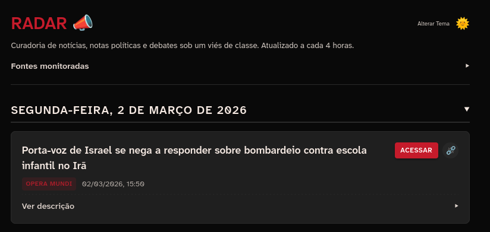

# Sobre

Este é um simples agregador de notícias feito a partir do template do gerador estático OsmosFeed. A cada 4 horas ele coleta notícias e artigos de ínumeros sites e compila em ordem cronológica. Ele permite o acesso à publicação original, compartilhamento por link ou, como pedido pelo sub, um social link para a republicação do conteúdo no r/BrasildoB.

